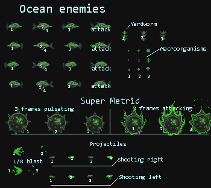

<h1>XENOSEA</h1>

<h2>Outline</h2>

Classic shooter flipped upside down as you descend into the life filled oceans of Europa. 

  <h3> Level design </h3>
  
tile based but with very tall levels. The idea is to get as much 'depth' as possible by descending mostly straight down. Repeating or infinite level at the end?
  

  <h3>Limitation</h3>
  

  The limitation is \'health as a tool\'. The harmful macroorganisms will spawn more when you have high health and helpful macroorganisms when you have low health.  High health could also lessen the cooldown of your weapons so it's a give and take.
  

   
<h2>Player</h2>

  <h3>Subs</h3>
  
The ships are shown here with the first on the bottom the second on the middle and the final ship on the top. New ships are found at a dock and you dock your current ship to take off in the new one. Use bubble.png and particles for propusion.

  <h3>Firing</h3>
  
Opening frame (2) is used to transition from idle to the firing frame for weapon in use

  
The blast originates from the user. Smallest laser shoots single shot of med size laset beam. Med laser shoots one med laser and then rapid full auto fire of smallest laser. fire rate could depend on health per the limitation.
  

  
Torpedoes use particle generatior of steam.png at origin and explosion.png at target. Large torpedo has 2 frame blink.

  <h3>Landing</h3>
  
Only the final sub is able to land. Frame 1 shown here is normal idle. Frame 2 is transitional. Frame 3 serves as idle when landed.
  

  <h3>Powerups</h3>
  
Macroorganisms with the blue glow give health. Other powerups give new weapons
  

  

   
<h2>Open ocean</h2>

  
Fish with noses ram the player. Shoort nose fishes shoot projectiles. Swimming animation sequence is 1,2,3,2

  
Yardwork lives on th ewalls and has 3 fram animation to crawl up and down

  
Harmful Macroorganisms will spawn more often when health is high and will hurt the player

  
Projectiles shoot left and right and have a 4 frame blinking/rotating animation. 1234,1234

  
Blast animation appears at origin of projectiles and is animated 1,2 and then disappears.
  <h3>Super Metrid</h3>
  
Boss Fight! Lots of health. Idle pulsating animation is 123,123. Attack animation is also 123,123

<h2>Deep ocean</h2>

  
Fish with noses ram the player as in ocean section above

  
Coming soon

   

<h2>Base</h2>

  
Coming soon

   

<h2>Other assets and Tilesets</h2>

  
Coming soon

   

<!--
###########################################################################

--> 
<h1>XENOSEA was created using:</h1>
<h1 align="center">
   
  
   
  Phaser 3 TypeScript Starter
   
</h1>

This is a [Phaser 3](https://github.com/photonstorm/phaser) starter with [TypeScript](https://www.typescriptlang.org/), [Rollup](https://rollupjs.org) with ⚡️ lightning fast HMR through [Vite](https://vitejs.dev/).

## Available Commands

| Command | Description |
|---------|-------------|
| `yarn install` | Install project dependencies |
| `yarn dev` | Builds project and open web server, watching for changes |
| `yarn build` | Builds code bundle with production settings  |
| `yarn serve` | Run a web server to serve built code bundle |

## Development

After cloning the repo, run `yarn install` from your project directory. Then, you can start the local development
server by running `yarn dev` and navigate to http://localhost:3000.

## Production

After running `yarn build`, the files you need for production will be on the `dist` folder. To test code on your `dist` folder, run `yarn serve` and navigate to http://localhost:5000