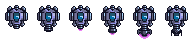
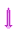
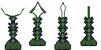
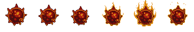
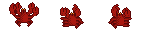
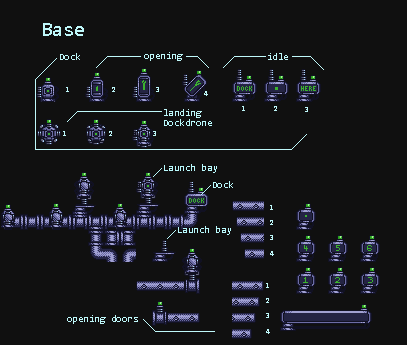

<h1>XENOSEA</h1>

<h2>Outline</h2>

Classic shooter flipped upside down as you descend into the life filled oceans of Europa. 

  <h3> Level design </h3>
  
tile based but with very tall levels. The idea is to get as much 'depth' as possible by descending mostly straight down. Repeating or infinite level at the end?
  

  <h3>Limitation</h3>
  

  The limitation is \'health as a tool\'. The harmful macroorganisms will spawn more when you have high health and helpful macroorganisms when you have low health.  High health could also lessen the cooldown of your weapons so it's a give and take.
  

   
<h2>Player</h2>

  <h3>Subs</h3>
  
The ships are shown here with the first on the bottom the second on the middle and the final ship on the top. New ships are found at a dock and you dock your current ship to take off in the new one. Use bubble.png and particles for propusion.

  

  
  
  <h3>Firing</h3>
  
Opening frame (2) is used to transition from idle to the firing frame for weapon in use

  
The blast originates from the user. Smallest laser shoots single shot of med size laset beam. Med laser shoots one med laser and then rapid full auto fire of smallest laser. fire rate could depend on health per the limitation.
  

  
Torpedoes use particle generatior of steam.png at origin and explosion.png at target. Large torpedo has 2 frame blink.

  <h3>Landing</h3>
  
Only the final sub is able to land. Frame 1 shown here is normal idle. Frame 2 is transitional. Frame 3 serves as idle when landed.
  

  <h3>Powerups</h3>
  
Macroorganisms with the blue glow give health. Other powerups give new weapons
  

   <h3>Assets</h3>

  <h4>Level 1 ship<h4>
  
  <ul>
    <li>Asset key: 'player-l1'</li>
    <li>path: 'public/assets/sprites/player/l1.png'</li>
    <li>dimensions: 32x48</li>
    <li>animations: 
      <ul>
        <li>key: 'player-l1-idle', frames: [0]</li>
        <li>key: 'player-l1-firing', frames: [0,1,n]</li>
      </ul>
    </li>
  </ul>

  <h4>Level 2 ship<h4>
  
  <ul>
    <li>Asset key: 'player-l2'</li>
    <li>path: 'public/assets/sprites/player/l2.png'</li>
    <li>dimensions: 32x32</li>
    <li>animations: 
      <ul>
        <li>key: 'player-l2-idle', frames: [0]</li>
        <li>key: 'player-l2-firing', frames: [0,1,n]</li>
      </ul>
    </li>
  </ul>
  <h4>Level 3 ship<h4>
  
  <ul>
    <li>Asset key: 'player-l3'</li>
    <li>path: 'public/assets/sprites/player/l3.png'</li>
    <li>dimensions: 32x32</li>
    <li>animations: 
      <ul>
        <li>key: 'player-l3-idle', frames: [0]</li>
        <li>key: 'player-l3-firing', frames: [0,1,n]</li>
        <li>key: 'player-l3-landing', frames: [6,7,8]</li>
      </ul>
    </li>
  </ul>
  <h4>Ship firing frame matrix (to get n above)</h4>
  <ul>
    <li>'laser1': 2</li>
    <li>'laser2': 3</li>
    <li>'laser3': 4</li>
    <li>'torpedo1': 5</li>
    <li>'torpedo2': 5</li>
    <li>'torpedo3': 5</li>
  </ul>

   <h4>l1 Laser<h4>
  
  <ul>
    <li>Asset key: 'player-laser1'</li>
    <li>path: 'public/assets/sprites/player/laser1.png'</li>
    <li>dimensions: 16x32</li>
  </ul>

   <h4>l2 laser<h4>
  
  <ul>
    <li>Asset key: 'player-laser2'</li>
    <li>path: 'public/assets/sprites/player/laser2.png'</li>
    <li>dimensions: 16x32</li>
  </ul>

   <h4>l3 laser<h4>
  
  <ul>
    <li>Asset key: 'player-laser3'</li>
    <li>path: 'public/assets/sprites/player/laser3.png'</li>
    <li>dimensions: 16x80</li>
  </ul>
 <h4>laser blast<h4>
  
  <ul>
    <li>Asset key: 'player-laserblast'</li>
    <li>path: 'public/assets/sprites/player/player-laserblast.png'</li>
    <li>dimensions: 16x16</li>
    <li>animations: 
      <ul>
        <li>key: 'player-laserblast-idle', frames: [0,1,2,3]</li>
      </ul>
    </li>
  </ul>
   <h4>l1 Torpedo<h4>
  
  <ul>
    <li>Asset key: 'player-torpedo1'</li>
    <li>path: 'public/assets/sprites/player/torpedo1.png'</li>
    <li>dimensions: 16x16</li>
  </ul>

   <h4>l2 Torpedo<h4>
  
  <ul>
    <li>Asset key: 'player-torpedo2'</li>
    <li>path: 'public/assets/sprites/player/torpedo2.png'</li>
    <li>dimensions: 16x16</li>
  </ul>

   <h4>l3 Torpedo<h4>
  
  <ul>
    <li>Asset key: 'player-torpedo3'</li>
    <li>path: 'public/assets/sprites/player/torpedo3.png'</li>
    <li>dimensions: 16x16</li>
    <li>animations: 
      <ul>
        <li>key: 'player-torpedo3-idle', frames: [0,1]</li>
      </ul>
    </li>
  </ul>

 

<h2>Open ocean</h2>

  <h3>Enemies</h3>
  
Fish swim back and forth. Swimming animation sequence is 1,2,3,2Fish with noses ram the player. Shoort nose fishes shoot projectiles.

  
Yardworm lives on the walls and has 3 frame animation to crawl up and down. Shoots projectiles at the player.

  
Harmful Macroorganisms will spawn more often when health is high and will hurt the player

  <h3>Projectiles</h3>
  
Projectiles shoot left and right and have a 4 frame blinking/rotating animation. 1234,1234

  
Blast animation appears at origin of projectiles and is animated 1,2 and then disappears.
  <h3>Super Metrid</h3>
  
Boss Fight! Lots of health. Idle pulsating animation is 123,123. Attack animation is also 123,123

   
   <h3>Assets</h3>

   <h4>Ocean fish 1<h4>
  
  <ul>
    <li>Asset key: 'ocean-fish1'</li>
    <li>path: 'public/assets/sprites/ocean/fish1.png'</li>
    <li>dimensions: 48x32</li>
    <li>animations: 
      <ul>
        <li>key: 'ocean-fish1-idle', frames: [5]</li>
        <li>key: 'ocean-fish1-idle-left', frames: [5]</li>
        <li>key: 'ocean-fish1-idle-right', frames: [1]</li>
        <li>key: 'ocean-fish1-swim-left', frames: [4,5,6]</li>
        <li>key: 'ocean-fish1-swim-right', frames: [0,1,2]</li>
        <li>key: 'ocean-fish1-attack-left', frames: [7]</li>
        <li>key: 'ocean-fish1-attack-right', frames: [3]</li>
      </ul>
    </li>
  </ul>
  <h4>Ocean fish 2<h4>
  
  <ul>
    <li>Asset key: 'ocean-fish2'</li>
    <li>path: 'public/assets/sprites/ocean/fish2.png'</li>
    <li>dimensions: 48x32</li>
    <li>animations: 
      <ul>
        <li>key: 'ocean-fish2-idle', frames: [5]</li>
        <li>key: 'ocean-fish2-idle-left', frames: [5]</li>
        <li>key: 'ocean-fish2-idle-right', frames: [1]</li>
        <li>key: 'ocean-fish2-swim-left', frames: [4,5,6]</li>
        <li>key: 'ocean-fish2-swim-right', frames: [0,1,2]</li>
        <li>key: 'ocean-fish2-attack-left', frames: [7]</li>
        <li>key: 'ocean-fish2-attack-right', frames: [3]</li>
      </ul>
    </li>
  </ul><h4>Yardworm<h4>
  
  <ul>
    <li>Asset key: 'ocean-yardworm'</li>
    <li>path: 'public/assets/sprites/ocean/yardworm.png'</li>
    <li>dimensions: 32x32</li>
    <li>animations: 
      <ul>
        <li>key: 'ocean-yardworm-idle', frames: [2]</li>
        <li>key: 'ocean-yardworm-crawl', frames: [1,2,3]</li>
      </ul>
    </li>
  </ul>
  </ul><h4>Macroorganism 1<h4>
  
  <ul>
    <li>Asset key: 'macroorganism1'</li>
    <li>path: 'public/assets/sprites/ocean/macroorganism1.png'</li>
    <li>dimensions: 16x16</li>
    <li>animations: 
      <ul>
        <li>key: 'ocean-macroorganism1-idle', frames: [0,1]</li>
        <li>key: 'ocean-macroorganism1-attack', frames: [0,1,2]</li>
      </ul>
    </li>
  </ul>
  </ul><h4>Macroorganism 2<h4>
  
  <ul>
    <li>Asset key: 'macroorganism2'</li>
    <li>path: 'public/assets/sprites/ocean/macroorganism2.png'</li>
    <li>dimensions: 16x16</li>
    <li>animations: 
      <ul>
        <li>key: 'ocean-macroorganism2-idle', frames: [0,1]</li>
        <li>key: 'ocean-macroorganism2-attack', frames: [0,1,2]</li>
      </ul>
    </li>
  </ul>
  </ul><h4>Macroorganism 3<h4>
  
  <ul>
    <li>Asset key: 'macroorganism3'</li>
    <li>path: 'public/assets/sprites/ocean/macroorganism3.png'</li>
    <li>dimensions: 16x16</li>
    <li>animations: 
      <ul>
        <li>key: 'ocean-macroorganism3-idle', frames: [0,1]</li>
        <li>key: 'ocean-macroorganism3-attack', frames: [0,1,2]</li>
      </ul>
    </li>
  </ul>
  <h4>Super Metrid<h4>
  
  <ul>
    <li>Asset key: 'supermetrid'</li>
    <li>path: 'public/assets/sprites/ocean/supermetrid.png'</li>
    <li>dimensions: 16x16</li>
    <li>animations: 
      <ul>
        <li>key: 'ocean-supermetrid-idle', frames: [0,1,2]</li>
        <li>key: 'ocean-supermetrid-attack', frames: [3,4,5]</li>
      </ul>
    </li>
  </ul>
  <h4>Ocean Projectile Left<h4>
  
  <ul>
    <li>Asset key: 'ocean-projectile-left'</li>
    <li>path: 'public/assets/sprites/ocean/projectile-left.png'</li>
    <li>dimensions: 16x16</li>
    <li>animations: 
      <ul>
        <li>key: 'ocean-projectile-left-idle', frames: [0,2,4,6]</li>
      </ul>
    </li>
  </ul>
  <h4>Ocean Projectile Right<h4>
  
  <ul>
    <li>Asset key: 'ocean-projectile-right'</li>
    <li>path: 'public/assets/sprites/ocean/projectile-right.png'</li>
    <li>dimensions: 16x16</li>
    <li>animations: 
      <ul>
        <li>key: 'ocean-projectile-right-idle', frames: [0,2,4,6]</li>
      </ul>
    </li>
  </ul>
  <h4>Ocean Blast Left<h4>
  
  <ul>
    <li>Asset key: 'ocean-blast-left'</li>
    <li>path: 'public/assets/sprites/ocean/blast-left.png'</li>
    <li>dimensions: 16x16</li>
    <li>animations: 
      <ul>
        <li>key: 'ocean-blast-left', frames: [0,1]</li>
      </ul>
    </li>
  </ul>
  <h4>Ocean Blast Right<h4>
  
  <ul>
    <li>Asset key: 'ocean-blast-right'</li>
    <li>path: 'public/assets/sprites/ocean/blast-right.png'</li>
    <li>dimensions: 16x16</li>
    <li>animations: 
      <ul>
        <li>key: 'ocean-blast-left', frames: [0,1]</li>
      </ul>
    </li>
  </ul>

<h2>Deep ocean</h2>

  <h3>Enemies</h3>
  
Fish with noses ram the player as in ocean section above

  
Crab crawls up and down usually on fungus. Shoots projectiles

  
Mushrooms generate spores. There is a dead frame so player can kill spore generator. Spores have 2 frame pulsating animatoin

  
Angerfish swims back and forth and shoots like short nose fish but in rapid fire

  <h3>Spore monster</h3>
  
Final unbeatable boss!
  
One or more spore sprites with an array of smaller sprites on top of it. Lives on the sides of the walls and shoots at the player? Descends from above forcing movement?

  
An infinitely deep shaft so you can run up your depth score. Just a narrow shaft that repeats.

  
  
  
  <h3>Assets</h3>

   <h4>deep fish 1<h4>
  
  <ul>
    <li>Asset key: 'deep-fish1'</li>
    <li>path: 'public/assets/sprites/deep/fish1.png'</li>
    <li>dimensions: 48x32</li>
    <li>animations: 
      <ul>
        <li>key: 'deep-fish1-idle', frames: [5]</li>
        <li>key: 'deep-fish1-idle-left', frames: [5]</li>
        <li>key: 'deep-fish1-idle-right', frames: [1]</li>
        <li>key: 'deep-fish1-swim-left', frames: [4,5,6]</li>
        <li>key: 'deep-fish1-swim-right', frames: [0,1,2]</li>
        <li>key: 'deep-fish1-attack-left', frames: [7]</li>
        <li>key: 'deep-fish1-attack-right', frames: [3]</li>
      </ul>
    </li>
  </ul>
   <h4>deep fish 2<h4>
  
  <ul>
    <li>Asset key: 'deep-fish2'</li>
    <li>path: 'public/assets/sprites/deep/fish2.png'</li>
    <li>dimensions: 48x32</li>
    <li>animations: 
      <ul>
        <li>key: 'deep-fish2-idle', frames: [4]</li>
        <li>key: 'deep-fish2-idle-left', frames: [4]</li>
        <li>key: 'deep-fish2-idle-right', frames: [1]</li>
        <li>key: 'deep-fish2-swim-left', frames: [3,4,5]</li>
        <li>key: 'deep-fish2-swim-right', frames: [0,1,2]</li>
        <li>key: 'deep-fish2-attack-left', frames: [4]</li>
        <li>key: 'deep-fish2-attack-right', frames: [1]</li>
      </ul>
    </li>
  </ul>
  <h1>TO DO</h1>
  <ul>

 <h4>Crab<h4>
  
  <ul>
    <li>Asset key: 'deep-crab'</li>
    <li>path: 'public/assets/sprites/deep/crab.png'</li>
    <li>dimensions: 48x32</li>
    <li>animations: 
      <ul>
        <li>key: 'deep-crab-idle', frames: [1]</li>
        <li>key: 'deep-crab-idle-down', frames: [4]</li>
        <li>key: 'deep-crab-idle-up', frames: [1]</li>
        <li>key: 'deep-crab-crawl-down', frames: [3,4,5]</li>
        <li>key: 'deep-crab-crawl-up', frames: [0,1,2]</li>
        <li>key: 'deep-crab-attack-down', frames: [4]</li>
        <li>key: 'deep-crab-attack-up', frames: [1]</li>
      </ul>
    </li>
  </ul>
  <h4>deep Projectile Left<h4>
  
  <ul>
    <li>Asset key: 'deep-projectile-left'</li>
    <li>path: 'public/assets/sprites/deep/projectile-left.png'</li>
    <li>dimensions: 16x16</li>
    <li>animations: 
      <ul>
        <li>key: 'deep-projectile-left-idle', frames: [0,1,2,3]</li>
      </ul>
    </li>
  </ul>
  <h4>deep Projectile Right<h4>
  
  <ul>
    <li>Asset key: 'deep-projectile-right'</li>
    <li>path: 'public/assets/sprites/deep/projectile-right.png'</li>
    <li>dimensions: 16x16</li>
    <li>animations: 
      <ul>
        <li>key: 'deep-projectile-right-idle', frames: [0,1,2,3]</li>
      </ul>
    </li>
  </ul>
  <h4>deep Blast Left<h4>
  
  <ul>
    <li>Asset key: 'deep-blast-left'</li>
    <li>path: 'public/assets/sprites/deep/blast-left.png'</li>
    <li>dimensions: 16x16</li>
    <li>animations: 
      <ul>
        <li>key: 'deep-blast-left', frames: [0,1]</li>
      </ul>
    </li>
  </ul>
  <h4>deep Blast Right<h4>
  
  <ul>
    <li>Asset key: 'deep-blast-right'</li>
    <li>path: 'public/assets/sprites/deep/blast-right.png'</li>
    <li>dimensions: 16x16</li>
    <li>animations: 
      <ul>
        <li>key: 'deep-blast-left', frames: [0,1]</li>
      </ul>
    </li>
  </ul>

  <h1>TO DO</h1>
  <ul>
  <li>sporegen</li>
  <li>spore</li>
  </ul>

 
  

<h2>Base</h2>

  <h3>Docks and launch bays</h3>
  
Dockdrone has 3 frame landing animation. From landed state it can transition to closed dock.

  
Closed dock has three frame opening animation. 

  
Open dock has three frame idle animation. 

  
Docks can open based on game progress. 

  
Launch bay can hold dockdrone in its landed state or ship upgrade

  <h3>Tiles and doors</h3>
  
Opening doors have 4 frame open animation

   

  <h3>Assets</h3>
  <h1>TO DO</h1>
  <ul>

  <li>Dockdrone</li>
  <li>Dock</li>

  </ul>

<h2>Other assets and Tilesets</h2>

   

<!--
###########################################################################

--> 
<h1>XENOSEA was created using:</h1>
<h1 align="center">
   
  
   
  Phaser 3 TypeScript Starter
   
</h1>

This is a [Phaser 3](https://github.com/photonstorm/phaser) starter with [TypeScript](https://www.typescriptlang.org/), [Rollup](https://rollupjs.org) with ⚡️ lightning fast HMR through [Vite](https://vitejs.dev/).

## Available Commands

| Command | Description |
|---------|-------------|
| `yarn install` | Install project dependencies |
| `yarn dev` | Builds project and open web server, watching for changes |
| `yarn build` | Builds code bundle with production settings  |
| `yarn serve` | Run a web server to serve built code bundle |

## Development

After cloning the repo, run `yarn install` from your project directory. Then, you can start the local development
server by running `yarn dev` and navigate to http://localhost:3000.

## Production

After running `yarn build`, the files you need for production will be on the `dist` folder. To test code on your `dist` folder, run `yarn serve` and navigate to http://localhost:5000